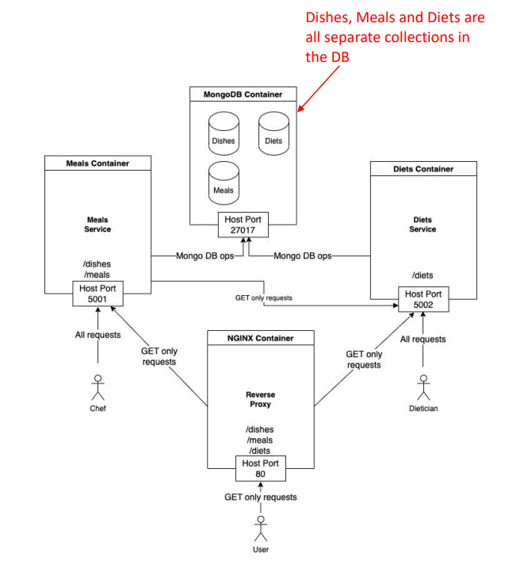

# Meals_App_With_Microservices

## API:
This project implements a RESTful API and extends [Meals And Dishes REST API](https://github.com/itayf9/Meals_And_Dishes_REST_API).

The service allows the users to:
- Invoke API requests to a service of meals, dishes and diets.
- Invoke API requests to a specific service (meals/diets).
- Save and retrive infomation (persistance).

In addition to the capabilities of the meals API, the service implements an API for diets:
- Users can add diets desctiptions. This include calories, sodium and sugar limitations.
- Users can find meals which match a specific diet.

## Architecture:
- Uses Docker Compose to create an application that is built from 4 services:
  1. A meals service.
  2. A diet service.
  3. A database service (which is built from MongoDB Docker image from DockerHub).
  4. A reverse-proxy service (which is built from NGINX Docker image from DockerHub).
- The meals and the diets services are persistent.
- Uses Docker Compose to restart the meals and diets services after a failure (and process requests as if it never failed).
- Uses a reverse-proxy (NGINX) to route requests to the right server.

  

## Docker:
This application can run in several different Docker containers, managed by Docker Compose.
